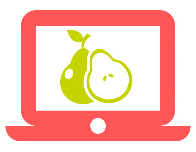

#  Pair Programming

If you're not familiar with the basics of Pair Programming, [watch this video](https://www.youtube.com/watch?v=ET3Q6zNK3Io).

Since you are working together remotely, you will use **Visual Studio Code** with the **LiveShare Plugin** for pair-programming (as mentioned in the [Pre-Start](pre-start.md) document).

---

## Roles and Obligations

### Mentee (Driver)
> The mentee is responsible for providing the context of the program. During pair-programming the mentee should perform the role of the "driver" as much as possible.
>
> ---
> ### Basic Obligations:
> 	- Providing a personal project that can either be **refactored** or **extended**, hosted on GitHub
> 	- Hosting the pair-programming sessions using VSCode with the Liveshare Plugin
> 	- Creating project documentation and tracking the tasks that are to be completed during the mentoring program
> 	- Completing self-assigned tasks between pairing sessions
> 	- Proactively lead communication

### Mentor (Navigator)
> The mentor is responsible for providing general feedback, PR reviews, and guidance during pair-programming sessions.
> 
> ---
> ### Basic Obligations
> 	- Forking the OpenPair repository & modifying it's contents according to their skill-set & intentions
> 	- Acquiring & Onboarding mentees
> 	- Organizing dates for pairing & video-chat sessions
> 	- Poviding feedback when PRs are created
> 	- Read supporting documents, such as resumes, in order to provide professional development feedback